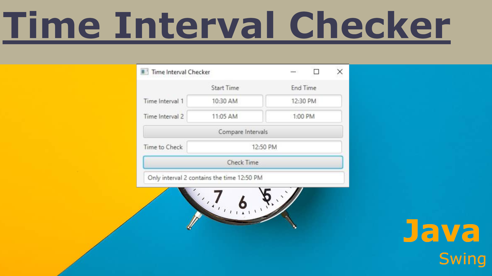

<p align="center">

</p>

# Interval Time Checker - Vadym Kharchenko
## Table of Contents
- [Project Overview](#project-overview)
- [Features](#features)
- [Code Functionality](code-functionality)
- [User Interface](#user-interface)
- [Technologies Used](#technologies-used)
- [Installation and Usage](#installation-and-usage)
- [How to Use](#how-to-use)
- [Error Handling](#error-handling)
- [Contributing](#contributing)
- [Contact](#contact)

  
## Project Overview
**CMSC215PROJ4KharchenkoV.java** is a Java Swing application designed to help users compare time intervals and check if a specific time falls within those intervals. It provides an intuitive graphical interface that allows users to input start and end times for two different intervals, then compare them to see if they overlap or are disjointed. Additionally, the program allows users to input a specific time to check whether it falls within one or both intervals.

## Features
- **Interval Comparison**: The application can determine if two intervals overlap or are disjointed.
- **Time Checker**: Users can input a specific time to check whether it is within one or both of the intervals.
- **Graphical User Interface**: The app uses Java Swing to create an easy-to-use interface with text fields for input and buttons for interval comparison and time checking.
- **Error Handling**: Includes input validation to handle incorrect time formats and invalid intervals.

## Code Functionality
1. **Interval Class**: A generic class that takes any comparable type (such as `Time`) and checks whether values fall within the defined interval or if two intervals overlap.
2. **Time Class**: A custom class that represents time in a 12-hour format with AM/PM designation. It includes methods to convert and compare times in 24-hour format.
3. **InvalidTime Exception**: A custom exception class to handle invalid time inputs.
4. **Swing Interface**: The graphical interface allows users to enter intervals and times, with buttons to trigger comparison and time checks.

## User Interface
- **Interval Input**: Users can enter two intervals, each with a start and end time.
- **Interval Comparison**: A button allows users to check whether the two intervals overlap or not.
- **Time Checker**: A separate field for users to input a time and buttons to check whether this time falls within one or both intervals.
- **Output Display**: Results are displayed in a text area at the bottom of the application.

## Technologies Used
- Java
- Java Swing (for the graphical user interface)
  
## Installation and Usage
1. **Clone the repository:**
   ```bash
   git clone https://github.com/YOUR-USERNAME/Interval-Time-Checker.git
   ```
2. Compile the Java program:
 ``` javac CMSC215PROJ4KharchenkoV.java ```
3. Run the program:
 ``` java CMSC215PROJ4KharchenkoV```
4. The application window will open where you can input the intervals and check times.

## How to Use
1. ***Enter Start and End Times:*** Input the start and end times for Interval 1 and Interval 2 in the text fields.
2. ***Compare Intervals:*** Click on the "Compare Intervals" button to check whether the two intervals overlap.
3. ***Check Time:*** Enter a time in the "Time to Check" field, then click the "Check Time" button to see if the time is contained in either or both intervals.
4. ***View Results:*** The results will be shown in the text area below.

## Error Handling
The program will show error messages for invalid time formats, such as:
- Entering hours outside the range of 1-12.
- Minutes outside the range of 0-59.
- Invalid AM/PM designations.
- Start time being greater than end time in an interval.

## Contributing
Contributions are welcome! Feel free to fork this repository, make your changes, and submit a pull request.


## Contact
If you have any questions or suggestions, feel free to contact me at:  
**Vadym Kharchenko**  
Email: vadym.kharchenko@yahoo.com

